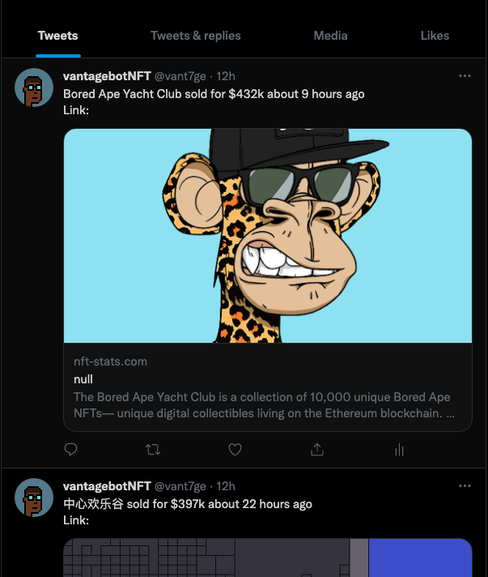

# DAILY NFTs BOT

 A twitter bot that tweets daily updates on the sales of the most expensive NFTs using the Top NFTs Sales API .

## Development
---

### 1. Clone the repository:
```shell
git clone git@github.com:vantage-ola/dailyNFTs-Bot.git
```
### 2. Create your branch:
Name your branch based on the feature you are working on. For example, Writing README branch would be called `feature/write_readme`:
```shell
git checkout -b <your branch name>
```
### 3. Create local environment ```.env```:
Create .env file in local directory. 
```shell 
touch .env
```
Get your Top NFTs Sales API key [https://rapidapi.com/NovusAPI/api/top-nft-sales](TopNFTsSalesAPI) and place it in this variable.
```shell 
NFT_API_KEY=[TOP_NFTs_SALES_API_KEY]
```
Include your Twitter Developer API Credentials [https://developer.twitter.com/en/portal/dashboard](TwitterAPI)
```shell 
TWITTER_API_KEY=[TWITTER_API_KEY]
API_KEY_SECRET=[TWITTER_API_KEY_SECRET]
API_BEARER_TOKEN=[TWITTER_API_BEARER_TOKEN]
ACCESS_TOKEN=[TWITTER_ACCESS_TOKEN]
ACCESS_TOKEN_SECRET=[TWITTER_TOKEN_SECRET]
```

